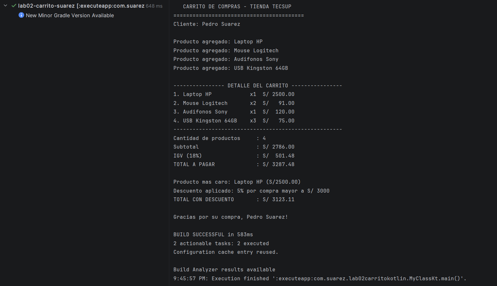

Laboratorio 02 - Carrito de Compras en Kotlin

**Estudiante:** Pedro Suarez  
**Curso:** Programación en Móviles  
**Institución:** TECSUP

1. Pregunta Teórica: val vs var en Data Class

**¿Por qué nombre y precio se declaran como val mientras que cantidad como var?**

- val (Inmutable): Las propiedades nombre y precio se definen con val porque representan atributos fijos e inmutables del producto. El nombre del artículo y su precio base no deben cambiar impredeciblemente a lo largo de la sesión de compra.
- var (Mutable): La propiedad cantidad se define con var porque es un valor dinámico que puede incrementarse, decrecer o actualizarse a medida que el cliente agrega o remueve unidades de un mismo producto en su carrito.

2. Captura de Pantalla del Resultado

A continuación se muestra la ejecución exitosa del programa en la consola:

