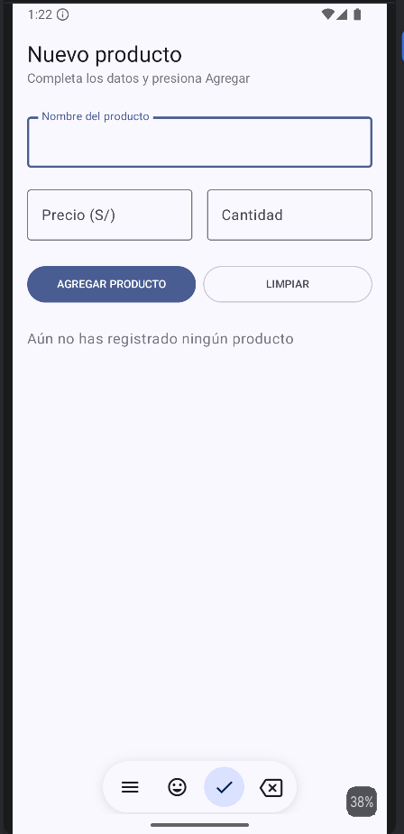
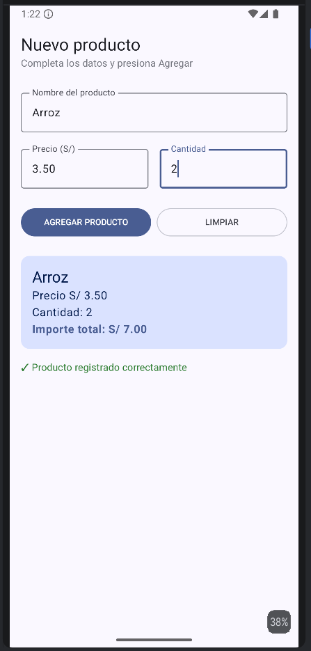

Laboratorio 03: Registro de Producto

**Estudiante:** 
**Curso:** Programación en Móviles

## Capturas de Pantalla

1. Pantalla Inicial

2. Producto Registrado

## Pregunta de Reflexión

**¿Qué pasaría si declaras las variables de los campos sin remember?**
Si no se utiliza remember, en cada recomposición (redibujado) del composable la variable se reinicia a su valor inicial (""). Esto provocará que al intentar escribir una letra, la pantalla se redibuje y borre inmediatamente el texto ingresado, impidiendo el registro de datos.

## Mejora con IA

| Prompt que usé | Qué generó Gemini | Qué acepté o corregí (y por qué) |
| :--- | :--- | :--- |
| "Agrega validación de campos vacíos (mostrar error en rojo) y un botón Limpiar en PantallaRegistro sin modificar la estructura principal." | Generó las variables de estado `mensajeError`, las validaciones con `isBlank()` y el botón Limpiar usando `Button`. | Cambié el botón Limpiar por un `OutlinedButton` para dar mejor jerarquía visual, añadí `KeyboardOptions` numéricos en precio/cantidad para mejorar la experiencia de usuario, y apliqué `.trim()` con Regex para validar caracteres en español. |
Guarda el README.md y ejecuta en la terminal: