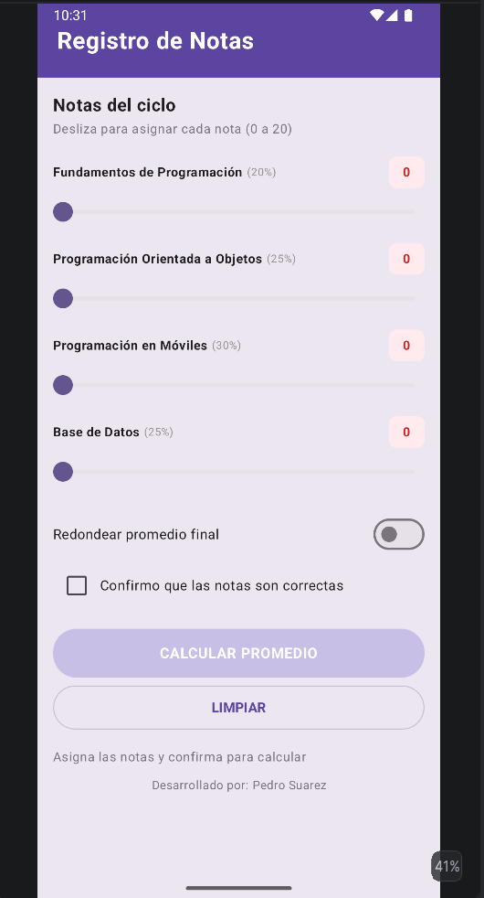
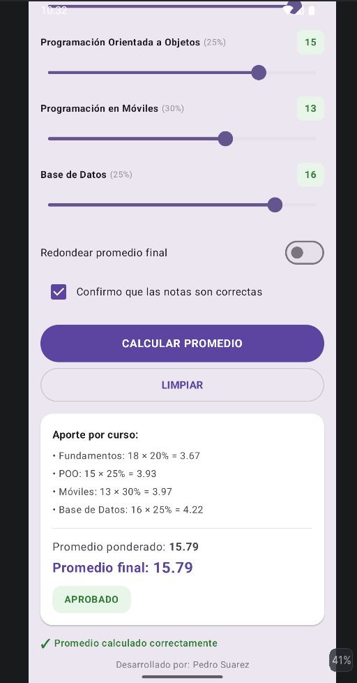

# Registro de Notas

Aplicación móvil desarrollada con Jetpack Compose para el cálculo y gestión del promedio ponderado del ciclo académico. La app permite asignar notas mediante desglosadores interactivos (sliders), evaluar aportes por asignatura en tiempo real y aplicar opciones avanzadas como el redondeo de la calificación final.

**Estudiante:** Pedro Suarez
**Carrera:** Diseño y Desarrollo de Software  
**Institución:** TECSUP

---

Tecnologías Utilizadas

`Kotlin` • `Android Studio` • `Jetpack Compose` • `Material 3` • `Git`

---

Capturas de Pantalla

1. Pantalla Inicial
---

2. Promedio Calculado
---
