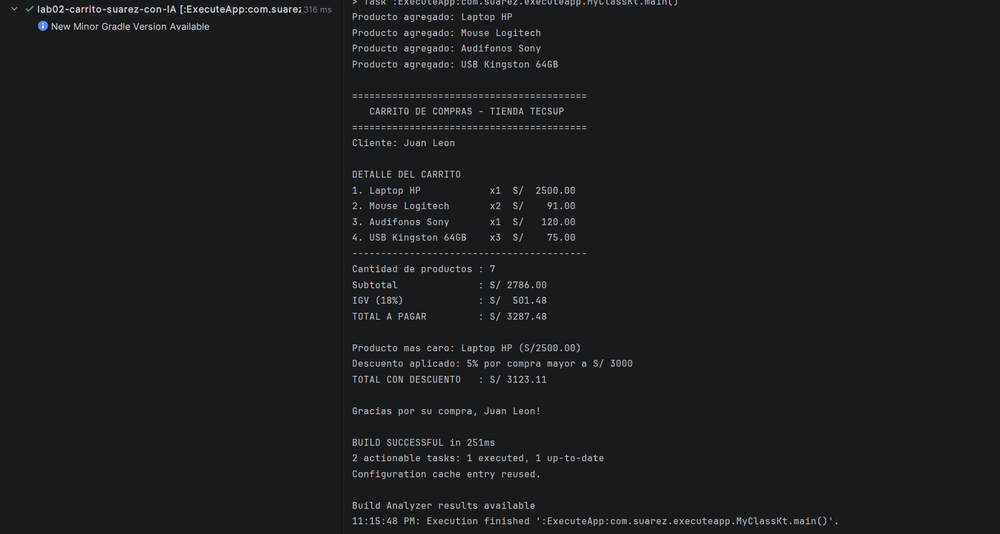

Laboratorio 02: Carrito de Compras en Kotlin (POO)

**Estudiante:** Pedro Suarez
**Curso:** Programación en Móviles - Tecsup

**Estructura del Prompt Utilizado**

Para solicitar la resolución y refactorización de este proyecto, se utilizó la siguiente estructura de Prompt Engineering:

1. **Rol / Contexto:** Definición del perfil experto (Desarrollador Kotlin Senior).
2. **Objetivo:** Declaración clara del desarrollo paso a paso y la evolución a POO.
3. **Requisitos Técnicos:** Inclusión explícita de los 4 pilares de POO (Abstracción, Herencia, Polimorfismo y Encapsulamiento) y restricciones de formato.
4. **Formato de Entregables:** Solicitud de código incremental acoplado a comandos de commit en español.

**Prompt Enviado a la IA**

Actúa como un Desarrollador Kotlin Senior y Profesor de Programación Móvil.

Necesito que me ayudes a resolver la actividad del laboratorio "Carrito de Compras en Kotlin" y luego refactorizarla completamente a Programación Orientada a Objetos (POO).

**Requisitos Obligatorios:**
1. **Fase 1 (Código Base):** Resuelve el laboratorio paso a paso con data class Producto, cálculo de subtotal, IGV (18%), total, reporte alineado con String.format, producto más caro con maxByOrNull y descuento con when.
2. **Fase 2 (Refactorización POO):** Adapta el programa para aplicar de forma explícita los 4 pilares:
- **Abstracción:** Clase abstracta ItemCarrito con el método calcularImporte().
- **Herencia:** Clases ProductoFisico y ProductoDigital derivadas de ItemCarrito.
- **Polimorfismo:** Implementación dinámica de calcularImporte() según el tipo de producto.
- **Encapsulamiento:** Ocultar la lista de productos (_items privada) dentro de la clase CarritoCompras.

**Captura del programa en funcionamiento:**

